# Visual guide: captured reference screens

Captured with headless Chromium at 1440×900 (desktop) and 390×844 (mobile) on 2026-10-06, after `document.fonts.ready`. The server renders the system font stack as the live site does, so these show the same type a Linux visitor sees. Mac visitors get SF Pro.

## Product UI: the submittal kanban mockup on `/rfi-submittal-management`

This is the closest public view of Cogram's actual RFI & Submittal interface, and the main reference for the Review Desk.

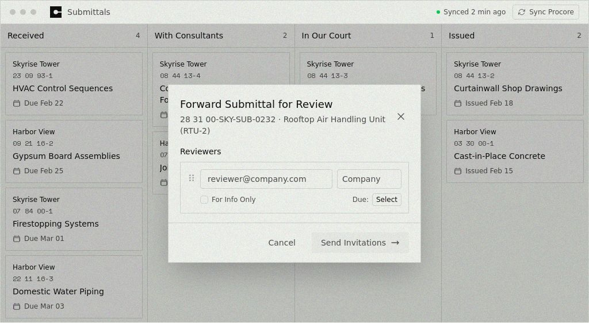

What to copy from it:
- Window chrome bar: grey dots, square mark plus "Submittals", green "Synced" dot and a bordered "Sync Procore" button
- Equal-width lanes separated by hairlines, each with a title and a count
- Cards: project, mono spec-section ID, title, calendar plus due date
- Modal: square corners, bordered field group, text "Cancel", arrow CTA

## RFIs & Submittals page

| Desktop | Mobile |
|---|---|
| 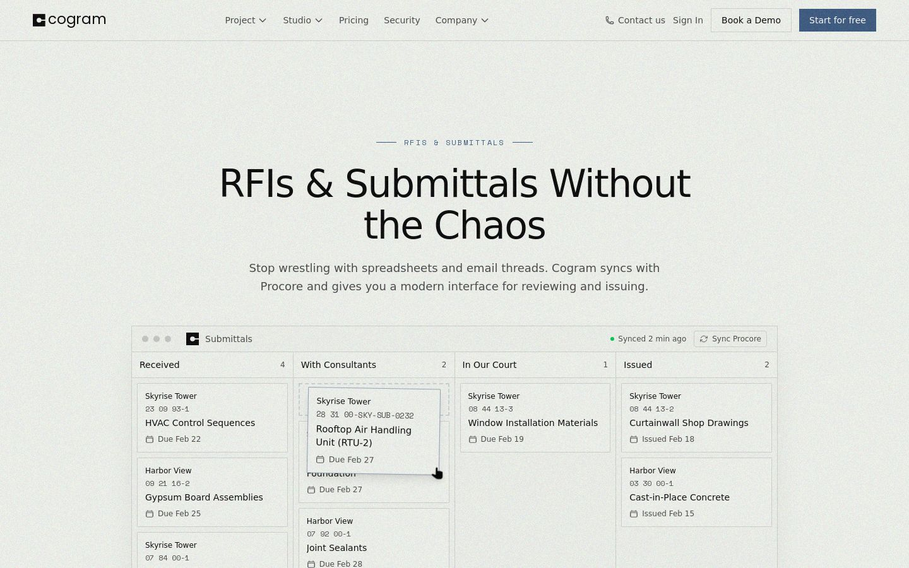 | 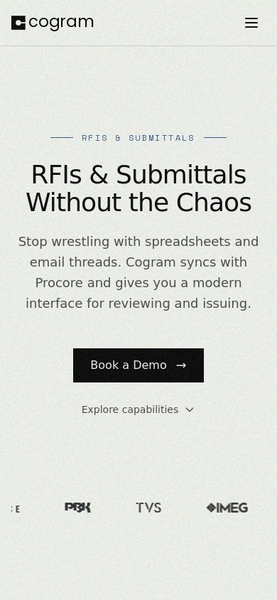 |

Eyebrow (rule · `RFIS & SUBMITTALS` · rule) in Space Mono primary blue, a 60px medium headline, a muted 18px lede, and nav CTAs "Book a Demo" (outline) and "Start for free" (primary #3d5a80). On mobile the window mockup is hidden behind a hamburger nav and a dark full-width CTA.

## Home

| Desktop | Mobile |
|---|---|
| 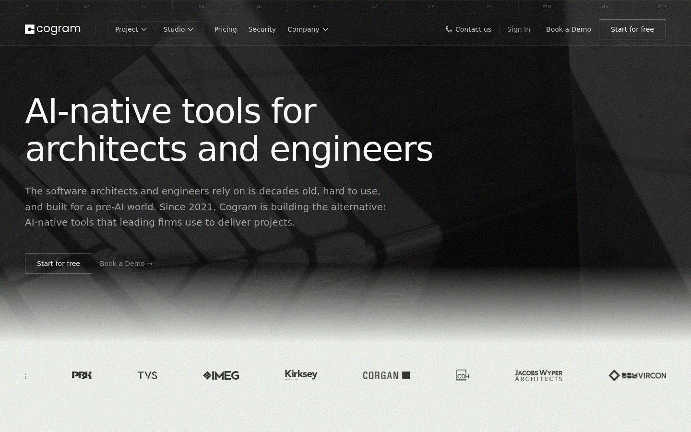 | 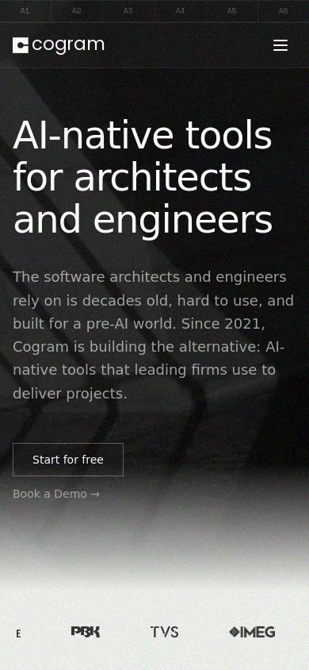 |

Dark photographic hero with a 12-column "A1…A12" drawing-sheet grid ruler across the top. It is an architectural reference worth reusing as a subtle detail.

## About

| Desktop | Mobile |
|---|---|
| 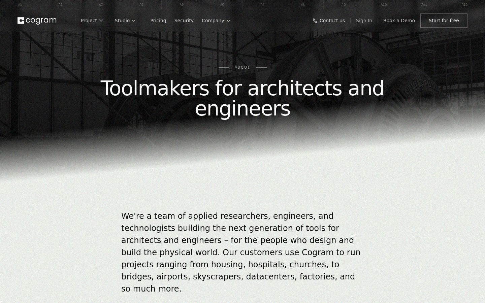 | 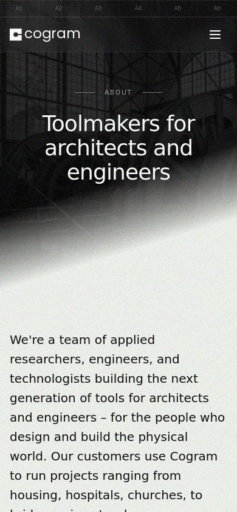 |

## Blog

| Desktop | Mobile |
|---|---|
| 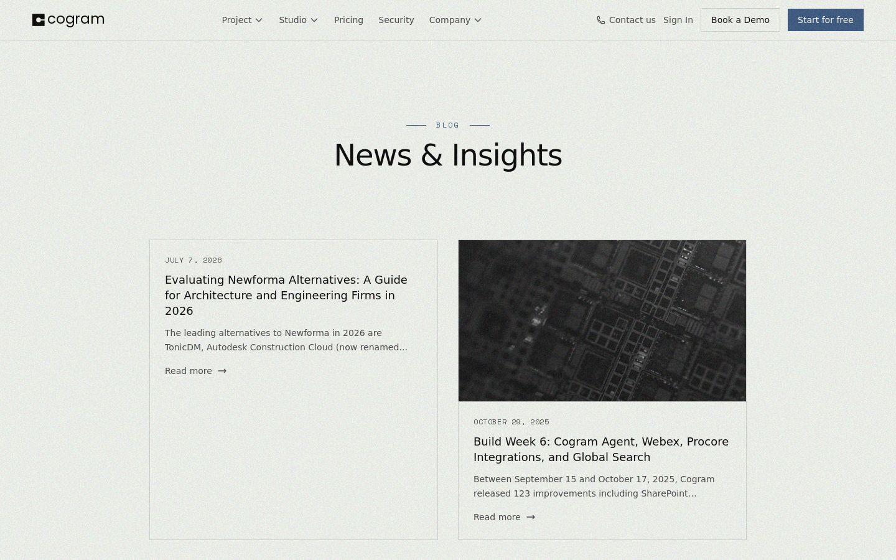 | 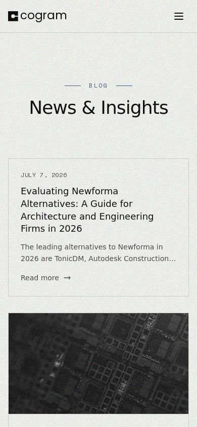 |

Content cards: 1px border, mono uppercase date, title, two-line excerpt, "Read more →".

## Docs (docs.cogram.com, GitBook)

| Desktop | Mobile |
|---|---|
| 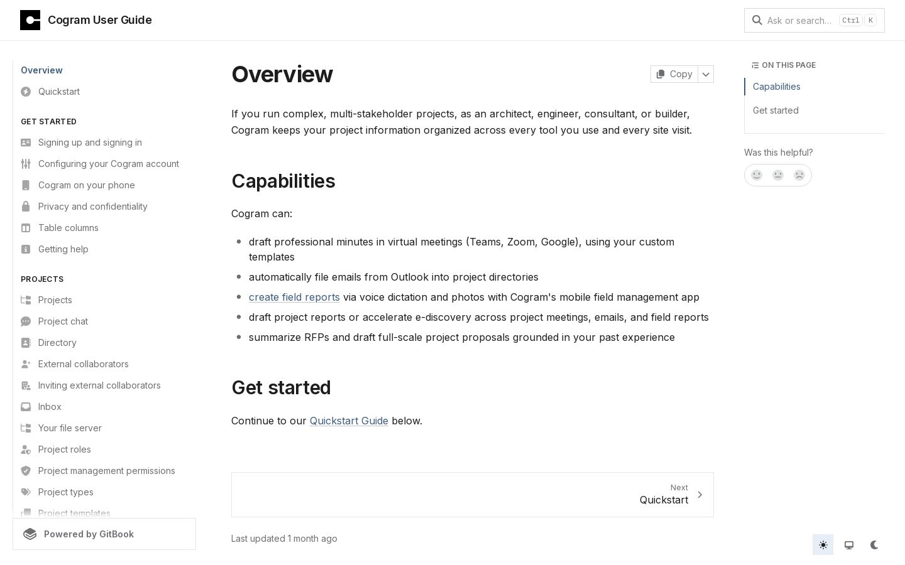 | 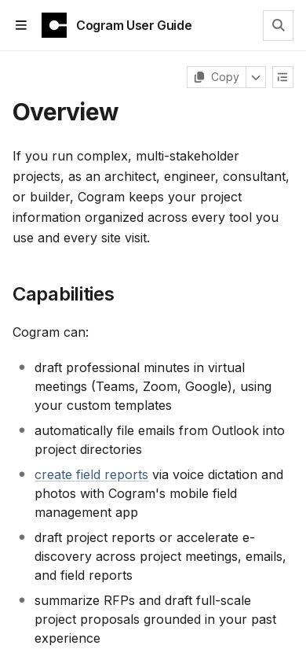 |

## How the Review Desk applies this

1. The header copies the RFI page nav: logo top-left, hairline bottom border, translucent canvas, primary CTA on the right.
2. The workspace sits inside the same window chrome as the kanban mockup, with "Submittals · Holloway Yard" and a "Synced" dot. The sync is labelled simulated.
3. Lanes, cards, spec IDs in Space Mono and due dates with a calendar icon all match the mockup.
4. The triage panel, evidence chips, audit table and eval lab use the same hairline, square-corner, mono-label vocabulary. No rounded "SaaS dashboard" cards, gradients or colour blocks beyond the palette above.
5. Footer: black band, "Independent concept by Ayo Ahmed. Not affiliated with Cogram."
